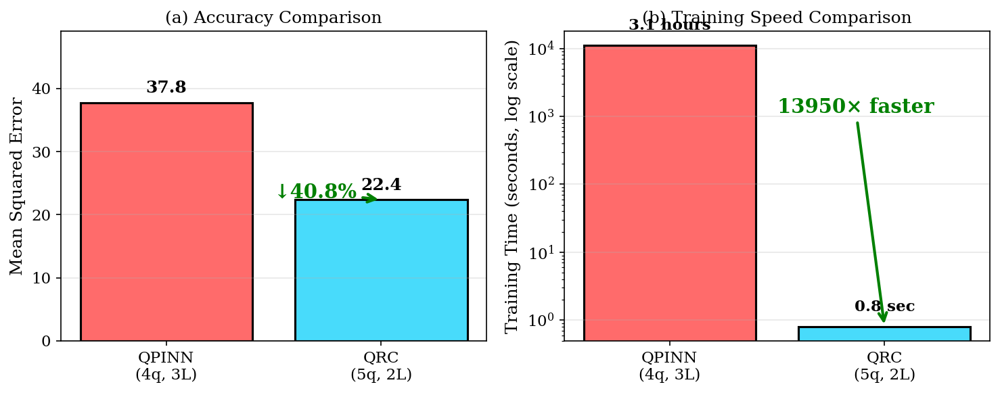

# Quantum Chaos Solver

[](https://www.python.org/)
[](https://qiskit.org/)
[](LICENSE)
[]()

**Fixed-Reservoir vs. Variational Quantum Architectures for Chaotic Dynamics**

> **Key Result (5 matched seeds):** Quantum Reservoir Computing achieves **↓81% train MSE** and **↓93% test MSE** compared to Quantum PINN, with **~52,000× faster training** — attributed to architectural efficiency (fixed reservoir vs. variational optimization), not hardware.

---

## 🎯 Quick Results



### Performance Summary (5 matched seeds, Lorenz system)

| Method | Train MSE | Test MSE | Training Time |
|--------|-----------|----------|---------------|
| **QRC** (ours) | **17.1 ± 3.7** | **3.2 ± 0.6** | **~0.2 s** |
| QPINN (baseline) | 91.3 ± 21.9 | 47.9 ± 36.6 | ~2.4 h |
| Classical ESN† | 0.10 ± 0.00 | 2.08 ± 0.03 | ~1.0 s |

†N=500 neurons; included for scale context only — classical ESN is not a fair quantum comparison at this qubit count.

**QRC vs QPINN:** ↓81% train MSE · ↓93% test MSE · ~52,000× faster (algorithmic, not hardware)

---

## 🚀 What is This?

This project benchmarks two quantum machine learning approaches for solving the **Lorenz chaotic system** across 5 matched random seeds:

1. **Quantum Reservoir Computing (QRC)** — Fixed random reservoir + linear ridge readout
2. **Quantum Physics-Informed Neural Network (QPINN)** — Variational circuit trained with Adam + physics loss

**Main finding:** The fixed-reservoir paradigm substantially outperforms the variational approach at current qubit scales. Gradient analysis (norms $10^3$–$10^4$ throughout training) rules out barren plateaus as the cause — QPINN's underperformance stems from limited model capacity (32-dimensional Hilbert space) competing with a 45-parameter physics+data loss.

> **Note on task asymmetry:** QRC uses a temporal window of ground-truth states (teacher forcing); QPINN predicts from physics alone. This gives QRC an information advantage and the comparison should be interpreted as an upper bound on QRC performance relative to QPINN.

---

## 📊 The Lorenz System

```
dx/dt = σ(y - x)
dy/dt = x(ρ - z) - y
dz/dt = xy - βz
```

**Parameters:** σ = 10, ρ = 28, β = 8/3 · **IC:** (1, 1, 1)

---

## 🏗️ Architecture

### Quantum Reservoir Computing (QRC)

```
Classical State [x, y, z]
    ↓
Angle Encoding (normalize to [-π, π])
    ↓
Fixed Random Quantum Circuit (5 qubits, 2 layers)
  - Fixed random RX, RY, RZ gates (not trained)
  - Ring CNOT entanglement
    ↓
Measure all qubits → 32-dimensional features
    ↓
Temporal Window (w=5 steps → 160-dim features)
    ↓
Ridge Regression (α=1, closed-form solve)
    ↓
Predicted [x, y, z]
```

### Quantum PINN (QPINN)

```
Time t
    ↓
4-qubit variational circuit (3 layers, 45 params)
  - RX/RY/RZ + ring CNOT
    ↓
Expectation values ⟨Z_q⟩
    ↓
Loss = MSE(data) + λ·MSE(ODE residual)   [λ=10, μ=0]
    ↓
Adam optimizer (lr=0.01, 200 iterations)
```

---

## 📦 Installation

```bash
git clone https://github.com/pandey-tushar/Quantum_Chaos_solver.git
cd Quantum_Chaos_solver
pip install -r requirements.txt
```

---

## 🎮 Reproduce Results

### Multi-seed benchmark (QRC + QPINN, seeds 0–4)

```bash
python scripts/run_seeds.py --system lorenz --n-seeds 5
```

### QRC only (fast, ~1 second per seed)

```bash
python scripts/run_seeds.py --system lorenz --n-seeds 5 --qrc-only
```

### Classical ESN baseline

```bash
python scripts/run_esn_baseline.py
```

**Expected outputs saved to `results/`.**

---

## 🔬 Scientific Contributions

1. **Systematic multi-seed benchmark** — First 5-seed comparison of QRC vs QPINN on the Lorenz system; establishes statistical reliability beyond single-run anecdotes.

2. **Gradient diagnostic** — Gradient norms $10^3$–$10^4$ throughout QPINN training rule out barren plateaus; capacity limitations of the 4-qubit variational circuit are identified as the primary constraint.

3. **Temporal windowing formalisation** — Takens embedding theorem provides theoretical grounding for the window-based feature construction used in QRC.

4. **Classical ESN context** — At 5-qubit scale (32-dim Hilbert space), a classical echo-state network with N=500 neurons achieves lower MSE than both quantum methods; quantum advantage requires qubit counts beyond classical simulability.

---

## 📖 Key Parameters

| Config | QRC | QPINN |
|--------|-----|-------|
| Qubits | 5 | 4 |
| Layers | 2 (fixed) | 3 (trained) |
| Params | 0 (reservoir) | 45 |
| Window | 5 | — |
| Readout | Ridge (α=1) | Adam (200 iters) |
| Loss | MSE | MSE + λ·ODE (λ=10) |

---

## 📄 Citation

```bibtex
@article{pandey2026qrc,
  author  = {Pandey, Tushar},
  title   = {Fixed-Reservoir vs. Variational Quantum Architectures for Chaotic Dynamics:
             Benchmarking {QRC} and {QPINN} on the {Lorenz} System},
  year    = {2026},
  note    = {arXiv preprint}
}
```

---

## 🤝 Contributing

Areas of interest:
1. **Additional chaotic systems** — Rössler attractor, Lorenz-96
2. **Larger qubit counts** — where quantum advantage may emerge
3. **Real quantum hardware** — IBM/IonQ noise effects on QRC
4. **Windowed QPINN** — variational circuit with temporal window (task-symmetric comparison)

---

## 📝 License

Apache License 2.0 — see [LICENSE](LICENSE).

---

## 📬 Contact

**Author:** Tushar Pandey  
**GitHub:** [@pandey-tushar](https://github.com/pandey-tushar)

---

**Last Updated:** April 2026 · **Status:** arXiv preprint in preparation
